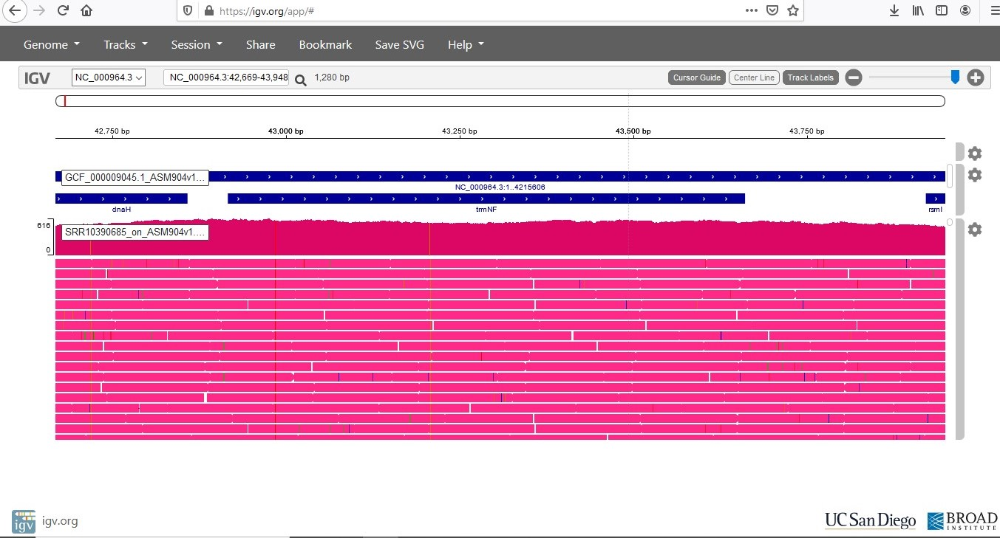

```{r setup, include=FALSE}
knitr::opts_chunk$set(eval=FALSE, echo =TRUE, cache = FALSE, message = FALSE, warning = FALSE, cache.lazy = FALSE,
                      fig.height = 3.5, fig.width = 10.5)
```

# Consignes {-}

Complétez ce document en remplissant les chunks vides pour écrire le code qui vous a permis de répondre à la question. Les réponses attendant un résultat chiffré ou une explication devront être insérés entre le balises html `code`. Par exemple pour répondre à la question suivante :

    La bioinfo c'est : <code>MERVEILLEUX</code>.
    
N'hésitez pas à commenter votre code, enrichier le rapport en y insérant des résultats ou des graphiques/images pour expliquer votre démarche. N'oubliez pas les **bonnes pratiques** pour une recherche **reproductible** !
Nous souhaitons à minima que l'analyse soit reproductible sur le cluster de l'IFB.

# Introduction {-}

Vous allez travailler sur des données de reséquençage d'un génome bactérien : _Bacillus subtilis_. Les données sont issues de cet article :

* [Complete Genome Sequences of 13 Bacillus subtilis Soil Isolates for Studying Secondary Metabolite Diversity](https://mra.asm.org/content/9/2/e01406-19)

# Analyses

## Organisation de votre espace de travail

```{bash}
#Inclure la lecture seule pour les dossiers rawdata

mkdir -p ~/EvaluationM4M5-EFLAVEN/ANALYSE/RAWDATA/FASTQ 
mkdir ~/EvaluationM4M5-EFLAVEN/ANALYSE/QC
mkdir -p ~/EvaluationM4M5-EFLAVEN/ANALYSE/Bacillus_subtilis/ASM904v1/
tree ~/EvaluationM4M5-EFLAVEN/ANALYSE

#Réservation des ressources sur le cluster de l'IFB

salloc --cpus-per-task=32 --mem=5G

```

## Téléchargement des données brutes

Récupérez les fichiers FASTQ issus du run **SRR10390685** grâce à l'outil <strong class="tool">sra-tools</strong> @sratoolkit

```{bash}
module load sra-tools/2.10.3
module list


fasterq-dump -h
srun --cpus-per-task=10 fasterq-dump --split-files -p SRR10390685 --outdir ~/EvaluationM4M5-EFLAVEN/ANALYSE/RAWDATA/FASTQ
#l'argument --split-files produit 2 fichiers (1 pour les R1 et 1 pour les R2)

#Compression des fichiers ils prendront moins de place sachant que des outils sont adaptés à l'utilisation de fichiers zippés

srun gzip ~/EvaluationM4M5-EFLAVEN/ANALYSE/RAWDATA/FASTQ/*.fastq 
```

Combien de reads sont présents dans les fichiers R1 et R2 ?

```{bash}
#On regarde les premières lignes du fichier (vérification du format)

srun zcat ~/EvaluationM4M5-EFLAVEN/ANALYSE/RAWDATA/FASTQ/SRR10390685_1.fastq.gz | head -n 12
srun zcat ~/EvaluationM4M5-EFLAVEN/ANALYSE/RAWDATA/FASTQ/SRR10390685_2.fastq.gz | head -n 12

expr $(zcat ~/EvaluationM4M5-EFLAVEN/ANALYSE/RAWDATA/FASTQ/SRR10390685_1.fastq.gz | wc -l) / 4

expr $(zcat ~/EvaluationM4M5-EFLAVEN/ANALYSE/RAWDATA/FASTQ/SRR10390685_2.fastq.gz | wc -l) / 4


```

Les fichiers FASTQ contiennent <code>7066055</code> reads.

Téléchargez le génome de référence de la souche ASM904v1 de _Bacillus subtilis_ disponible à [cette adresse](https://ftp.ncbi.nlm.nih.gov/genomes/all/GCF/000/009/045/GCF_000009045.1_ASM904v1/GCF_000009045.1_ASM904v1_genomic.fna.gz)

```{bash}
cd ~/EvaluationM4M5-EFLAVEN/ANALYSE/Bacillus_subtilis/ASM904v1/

srun wget "https://ftp.ncbi.nlm.nih.gov/genomes/all/GCF/000/009/045/GCF_000009045.1_ASM904v1/GCF_000009045.1_ASM904v1_genomic.fna.gz"

zcat GCF_000009045.1_ASM904v1_genomic.fna.gz | head -n 8

```

Quelle est la taille de ce génome ?

```{bash}
srun zcat ~/EvaluationM4M5-EFLAVEN/ANALYSE/Bacillus_subtilis/ASM904v1/GCF_000009045.1_ASM904v1_genomic.fna.gz| grep -v ">" -c

#La commande ci-dessus nous compte le nombre de ligne après avoir retiré la ligne d'info commençant par ">" (fichier fasta)

srun zcat ~/EvaluationM4M5-EFLAVEN/ANALYSE/Bacillus_subtilis/ASM904v1/GCF_000009045.1_ASM904v1_genomic.fna.gz | grep -v ">" | wc -m

#La commande ci-dessus nous compte le nombre de caractères après avoir retiré la ligne d'info commençant par ">" (fichier fasta)

expr $(zcat GCF_000009045.1_ASM904v1_genomic.fna.gz| grep -v ">" | wc -m) - $(zcat GCF_000009045.1_ASM904v1_genomic.fna.gz| grep -v ">" -c)

# il faut retirer le retour chariot présent à la fin de chaque ligne du fichier fasta pour avoir la taille du génome (soit 1 caractère en moins par ligne)

```

La taille de ce génome est de <code>4215606</code> paires de bases.

Téléchargez l'annotation de la souche ASM904v1 de _Bacillus subtilis_ disponible à [cette adresse](https://ftp.ncbi.nlm.nih.gov/genomes/all/GCF/000/009/045/GCF_000009045.1_ASM904v1/GCF_000009045.1_ASM904v1_genomic.gff.gz)

```{bash}
srun wget "https://ftp.ncbi.nlm.nih.gov/genomes/all/GCF/000/009/045/GCF_000009045.1_ASM904v1/GCF_000009045.1_ASM904v1_genomic.gff.gz"
zcat GCF_000009045.1_ASM904v1_genomic.gff.gz | head -n 8

#Nous voyons ainsi que c'est un fihier gff version 3, et donc un fichier tabulé de 9 colonnes avec les noms des gènes en colonne 9

```

Combien de gènes sont connus pour ce génome ?

```{bash}
#On décompresse le fichier d'annotation du génome

srun gunzip ~/EvaluationM4M5-EFLAVEN/ANALYSE/Bacillus_subtilis/ASM904v1/GCF_000009045.1_ASM904v1_genomic.gff.gz

#On utilise deux methodes différentes pour comparer

srun grep -c "ID=gene" ~/EvaluationM4M5-EFLAVEN/ANALYSE/Bacillus_subtilis/ASM904v1/GCF_000009045.1_ASM904v1_genomic.gff

#ou en détaillant afin d'être sûr qu'il n'y est pas de redondance dans les noms de gène 

srun cut -f 9 ~/EvaluationM4M5-EFLAVEN/ANALYSE/Bacillus_subtilis/ASM904v1/GCF_000009045.1_ASM904v1_genomic.gff | cut -d ";" -f 1 | grep "ID=gene" | sort -u | wc -l

#Nous sommes rassurés sur le fait que les deux codes nous donnent le même résultat

```

<code>4536</code> gènes sont recensés dans le fichier d'annotation.

## Contrôle qualité

Lancez l'outil <strong class="tool">fastqc</strong> @fastqc dédié à l'analyse de la qualité des bases issues d'un séquençage haut-débit

```{bash}
#On charge les outils de QC

module load fastqc/0.11.9
module load multiqc/1.9
module list

#On les utilise : MultiQC est un rapport des FASTQC compilant les informations pour les R1 et les R2

srun --cpus-per-task 8 fastqc ~/EvaluationM4M5-EFLAVEN/ANALYSE/RAWDATA/FASTQ/SRR10390685_1.fastq.gz -o ~/EvaluationM4M5-EFLAVEN/ANALYSE/QC/
srun --cpus-per-task 8 fastqc ~/EvaluationM4M5-EFLAVEN/ANALYSE/RAWDATA/FASTQ/SRR10390685_2.fastq.gz -o ~/EvaluationM4M5-EFLAVEN/ANALYSE/QC/
srun multiqc -d ~/EvaluationM4M5-EFLAVEN/ANALYSE/QC/ -o ~/EvaluationM4M5-EFLAVEN/ANALYSE/QC/

```

La qualité des bases vous paraît-elle satisfaisante ? Pourquoi ?

- [x] Oui
- [ ] Non

Liens vers les deux rapports html:
- [FASTQC_R1](https://eflaven.github.io/Evaluation_M4M5_EF/SRR10390685_1_fastqc.html) 
- [FASTQC_R2](https://eflaven.github.io/Evaluation_M4M5_EF/SRR10390685_2_fastqc.html)

car <code> la qualité moyenne par base pour tous les reads (fichier R1 et fichier R2) est supérieur à 30 au niveau du Phred score </code> comme le montre <code> l'histogramme sur la qualité des séquences du rapport MultiQC </code>

Lien vers le [rapport MulitQC](https://eflaven.github.io/Evaluation_M4M5_EF/multiqc_report.html)

Est-ce que les reads déposés ont subi une étape de nettoyage avant d'être déposés ? Pourquoi ?

- [x] Oui
- [ ] Non

car <code> les tailles des reads sont variables, en effet les tailles des reads brutes sont normalement identiques </code>

Quelle est la profondeur de séquençage (calculée par rapport à la taille du génome de référence) ?

```{bash}
nb_tot_reads=$((7066055*150*2))
nb_tot_genref=4215606
depth_run=$(($nb_tot_reads/$nb_tot_genref))
echo $depth_run
```

La profondeur de séquençage est de : <code>502</code> X.

## Nettoyage des reads

Vous voulez maintenant nettoyer un peu vos lectures. Choisissez les paramètres de <strong class="tool">fastp</strong> @fastp qui vous semblent adéquats et justifiez-les.

```{bash}
module load fastp/0.20.0
module list
mkdir ~/EvaluationM4M5-EFLAVEN/ANALYSE/CLEANING
srun --cpus-per-task 8 fastp --in1 ~/EvaluationM4M5-EFLAVEN/ANALYSE/RAWDATA/FASTQ/SRR10390685_1.fastq.gz --in2 ~/EvaluationM4M5-EFLAVEN/ANALYSE/RAWDATA/FASTQ/SRR10390685_2.fastq.gz --out1 ~/EvaluationM4M5-EFLAVEN/ANALYSE/CLEANING/SRR10390685_1.cleaned_filtered.fastq.gz --out2 ~/EvaluationM4M5-EFLAVEN/ANALYSE/CLEANING/SRR10390685_2.cleaned_filtered.fastq.gz --html ~/EvaluationM4M5-EFLAVEN/ANALYSE/CLEANING/fastp.html --thread 8 --cut_tail --cut_mean_quality 28 --cut_window_size 10 --length_required 80 --failed_out ~/EvaluationM4M5-EFLAVEN/ANALYSE/CLEANING/failed_out.txt --json /dev/null

#Nombre de reads pairés conservés

nb_tot_reads_retenus=13713974
nb_tot_readspaired_retenus=$(($nb_tot_reads_retenus/2))

echo $nb_tot_readspaired_retenus

```

Les paramètres suivants ont été choisis : 


| Parametre              | Valeur   |  Explication                                                                              |
|:-----------------------|:--------:|-------------------------------------------------------------------------------------------|
|--cut_tail              |          |visualise les reads à partir du 3' et coupe tant que les paramètres ne sont pas respectés. |
|--cut_tail_window_size  |10        |Défini la taille de la fenêtre de lecture pour le --cut_tail                               |
|--cut_tail_mean_quality |28        |Défini le seuil de qualité pour le  --cut_tail                                             |
|--length_required       |80        |Défni la taille min des reads                                                              |


Par défaut <strong class="tool">fastp</strong> @fastp applique déjà plusieurs filtres intéressants sur la qualité, sur la longueur des reads et sur le retrait des adaptateurs lorsqu'ils sont encore présents.


Ces paramètres ont permis de conserver <code>6856987</code> reads pairés, soit une perte de <code>3</code>% des reads bruts.

## Alignement des reads sur le génome de référence

Maintenant, vous allez aligner ces reads nettoyés sur le génome de référence à l'aide de <strong class="tool">bwa</strong> @bwa et <strong class="tool">samtools</strong> @samtools.

```{bash}
module load samtools/1.10
module load bwa/0.7.17
module list

srun gunzip ~/EvaluationM4M5-EFLAVEN/ANALYSE/Bacillus_subtilis/ASM904v1/GCF_000009045.1_ASM904v1_genomic.fna.gz

#On commence par indexer le génome de ref avec bwa index (un fichier.fna est un fichier multi fasta)

mkdir ~/EvaluationM4M5-EFLAVEN/ANALYSE/MAPPING

srun cp ~/EvaluationM4M5-EFLAVEN/ANALYSE/Bacillus_subtilis/ASM904v1/GCF_000009045.1_ASM904v1_genomic.fna ~/EvaluationM4M5-EFLAVEN/ANALYSE/MAPPING/

srun bwa index ~/EvaluationM4M5-EFLAVEN/ANALYSE/MAPPING/GCF_000009045.1_ASM904v1_genomic.fna

#Ensuite on réalise le mapping avec bwa mem

srun --cpus-per-task=32 bwa mem ~/EvaluationM4M5-EFLAVEN/ANALYSE/MAPPING/GCF_000009045.1_ASM904v1_genomic.fna ~/EvaluationM4M5-EFLAVEN/ANALYSE/CLEANING/SRR10390685_1.cleaned_filtered.fastq.gz ~/EvaluationM4M5-EFLAVEN/ANALYSE/CLEANING/SRR10390685_2.cleaned_filtered.fastq.gz -t 32 > ~/EvaluationM4M5-EFLAVEN/ANALYSE/MAPPING/SRR10390685_on_ASM904v1.sam

```

Combien de reads ne sont pas mappés ?

```{bash}
#Transformation du fichier .sam en .bam

srun --cpus-per-task=8 samtools view --threads 8 ~/EvaluationM4M5-EFLAVEN/ANALYSE/MAPPING/SRR10390685_on_ASM904v1.sam -b > ~/EvaluationM4M5-EFLAVEN/ANALYSE/MAPPING/SRR10390685_on_ASM904v1.bam

#Sort

srun samtools sort ~/EvaluationM4M5-EFLAVEN/ANALYSE/MAPPING/SRR10390685_on_ASM904v1.bam -o ~/EvaluationM4M5-EFLAVEN/ANALYSE/MAPPING/SRR10390685_on_ASM904v1.sort.bam

#Index

srun samtools index ~/EvaluationM4M5-EFLAVEN/ANALYSE/MAPPING/SRR10390685_on_ASM904v1.sort.bam

rm -f ~/EvaluationM4M5-EFLAVEN/ANALYSE/MAPPING/SRR10390685_on_ASM904v1.bam ~/EvaluationM4M5-EFLAVEN/ANALYSE/MAPPING/SRR10390685_on_ASM904v1.sam

# Utilisation du flag (0X4) pour déterminer les nombres de reads non mappés

srun samtools view --threads 10 -c -F 0X4 ~/EvaluationM4M5-EFLAVEN/ANALYSE/MAPPING/SRR10390685_on_ASM904v1.sort.bam 

```


<code>13021738</code> reads ne sont pas mappés.

## Croisement de données

Calculez le nombre de reads qui chevauchent avec au moins 50% de leur longueur le gène _trmNF_ grâce à l'outil <strong class="tool">bedtools</strong> @bedtools:

```{bash}
module load bedtools/2.29.2

#Conversion du fichier .bam en fichier .bed

srun bedtools bamtobed -i ~/EvaluationM4M5-EFLAVEN/ANALYSE/MAPPING/SRR10390685_on_ASM904v1.sort.bam > ~/EvaluationM4M5-EFLAVEN/ANALYSE/MAPPING/SRR10390685_on_ASM904v1.sort.bed

#On utilise la fonction intersect avec -c (ajout /ligne)

srun bedtools intersect -a ~/EvaluationM4M5-EFLAVEN/ANALYSE/Bacillus_subtilis/ASM904v1/GCF_000009045.1_ASM904v1_genomic.gff -b ~/EvaluationM4M5-EFLAVEN/ANALYSE/MAPPING/SRR10390685_on_ASM904v1.sort.bed  -c -F 0.50 > ~/EvaluationM4M5-EFLAVEN/ANALYSE/MAPPING/intersect_Genref_SRR10390685_on_ASM904v1_F50.bed

#Le comptage spécifique pour trmNF
srun grep "Name=trmNF" ~/EvaluationM4M5-EFLAVEN/ANALYSE/MAPPING/intersect_Genref_SRR10390685_on_ASM904v1_F50.bed

```

<code>2837</code> reads chevauchent le gène d'intérêt avec au moins 50% de leur longueur.


## Visualisation

Utilisez <strong class="tool">IGV</strong> @igv sous [sa version en ligne](https://igv.org/app/) pour visualiser les alignements sur le gène. Faites une capture d'écran du gène entier.

```{bash}
#Annotation du génome de ref avec Samtools, IGV demande deux fichiers (.fasta et .fai)
#Changement du .fna en .fasta
mv ~/EvaluationM4M5-EFLAVEN/ANALYSE/Bacillus_subtilis/ASM904v1/GCF_000009045.1_ASM904v1_genomic.fna ~/EvaluationM4M5-EFLAVEN/ANALYSE/Bacillus_subtilis/ASM904v1/GCF_000009045.1_ASM904v1_genomic.fasta

#.fai avec samtaools
samtools faidx ~/EvaluationM4M5-EFLAVEN/ANALYSE/Bacillus_subtilis/ASM904v1/GCF_000009045.1_ASM904v1_genomic.fasta


```



# References